# Architecture and maintenance

The code separates asset preparation, CPU pose evaluation, GPU work, and browser controls. The renderer still follows the case study's central rule: prepare immutable state when loading, and reuse it when drawing.

## Module boundaries

| Directory        | Responsibility                                                                                  | Dependencies                                                                                |
| ---------------- | ----------------------------------------------------------------------------------------------- | ------------------------------------------------------------------------------------------- |
| `src/gltf/`      | File decoding, validation, compression, accessors, canonical geometry, selected-scene traversal | Web platform, gl-matrix, meshoptimizer and decoder artifacts; no renderer or viewer imports |
| `src/animation/` | Track preparation/interpolation, local-pose mixing and playback policy                          | glTF data and CPU scene poses                                                               |
| `src/scene/`     | Mutable node poses, revisions, shared deformation inputs, CPU deformation oracle                | glTF data and animation sampling; no GPU allocations                                        |
| `src/renderer/`  | Resource preparation, bindings, compute/render passes, lighting and presentation                | CPU modules and WebGPU; no viewer imports                                                   |
| `src/app/`       | DOM controls, model/environment loading lock, status, demo and styles                           | Public renderer API and loading helpers                                                     |
| `src/main.ts`    | Start the viewer                                                                                | Application only                                                                            |

`gltf/scene.ts` traverses the selected asset scene for initial instances. `scene/pose.ts` evaluates the mutable runtime hierarchy. `renderer/scene/` builds GPU draw records and consumes pose revisions. These are deliberately separate responsibilities despite referring to the same glTF nodes.

`scene/lights.ts` uses the same selected-scene membership rules to validate and instantiate punctual lights. Its pose revision checks remain CPU-only. `lighting/punctual.ts` owns light/shadow GPU records and pass encoding; `lighting/shadows/` handles projection fitting and load-time depth pipeline caching. Shader declarations use one fixed lighting interface across color variants, with the material struct shared by color and alpha-tested shadow shaders.

`tests/architecture.test.ts` checks that CPU modules do not import the renderer/viewer, that renderer modules do not import the application, and that static module dependencies have no cycles. It reads raw source, so the checks do not require WebGPU globals.

## Public entry points

Embedding code can import from `src/index.ts`, which exports `Renderer`, settings/statistics types, `AnimationController`, asset types, and loading helpers. `src/renderer/index.ts` exports the rendering API alone. The existing `src/renderer/renderer.ts` entry and renderer methods remain available, including the animation forwarding aliases.

```ts
import { Renderer, loadUrl } from './src';

const renderer = await Renderer.create(canvas, showError);
await renderer.setAsset(await loadUrl(modelUrl));
renderer.animation.setPlaying(false);
renderer.setFrustumCulling(true);
```

Feature implementation paths moved during the refactor. Imports of internal files must use their new locations; application consumers should prefer the public entry points above. The code map in the README lists the new locations.

## Loading and ownership

`loadFiles()` and `loadUrl()` resolve compressed data before returning an `Asset`. Meshopt replaces bufferViews while retaining accessor offsets and strides, including animation and morph streams. Draco creates primitive-specific decoded accessors without modifying accessors shared by other primitives. Basis KTX2 sources become CPU `decodedImages` with authored mip levels. The loader's worker owns WASM state and transferred payload copies and is terminated in a `finally` block. Original shared buffers are never transferred or detached. `MaterialFactory` uploads decoded texture levels with the same format-aware image cache and fixed slot layout used by ordinary images.

Quantization uses the normal accessor conversion and float repacking paths. Bounds, deformation caches and draw pipelines need no compressed variants. These load-time operations do not change the frame phases below. Decoder scripts/WASM are emitted build assets; the Three.js package provides those artifacts without importing its engine.

`Renderer.setAsset()` creates candidate `Resources` and opens a GPU validation scope. `SceneBuilder.prepare()` constructs the candidate, including all pipelines and material bind groups. Only a successful candidate replaces the current scene and attaches its pose to the animation controller. Failure destroys candidate allocations and retains the displayed scene.

Preparation delegates vertex/index uploads to `GeometryUploader`. Its view and index caches live for one candidate scene. CPU `DeformationInputCache` and GPU `GpuDeformationInputCache` share immutable primitive inputs across nodes; each `GpuDeformation` retains independent output, palette and weight ranges. Compatible nodes share aligned arenas planned by `deformation/batch.ts`, with device-limit splitting and standalone singleton fallback. The builder reuses one deformation pipeline across scene replacements. Material and scene pipeline caches remain scoped to a candidate scene.

| Owner                 | Owned state                                                                        | Released when                                                                |
| --------------------- | ---------------------------------------------------------------------------------- | ---------------------------------------------------------------------------- |
| Scene `Resources`     | Geometry, instance transforms, material textures/uniforms, deformation buffers     | Replacement, preparation failure, renderer disposal                          |
| `SceneBindings`       | Frame uniform buffer; explicit scene binding layouts                               | Renderer disposal                                                            |
| `Viewport`            | Matching depth attachment                                                          | Resize or renderer disposal                                                  |
| `OutputPass`          | HDR/MSAA attachments and presentation resources                                    | Resize or renderer disposal                                                  |
| `EnvironmentLighting` | Environment maps and lighting parameters/LUT                                       | Environment replacement or renderer disposal, according to resource lifetime |
| `PunctualLighting`    | Light records, shadow matrix uniforms, reusable depth attachment and depth storage | Renderer disposal; allocations are reused across model replacement           |
| `Renderer`            | Device/context, camera controls, RAF loop and subsystem coordination               | `destroy()`                                                                  |

Bind groups and pipelines do not have explicit destroy methods. Their references disappear with their owners. Layouts are fixed for the renderer lifetime; texture presence never changes the material interface.

## Frame phases

```mermaid
flowchart LR
    A[AnimationController evaluates Pose] --> B[uploadPose updates changed inputs and bounds]
    B --> C[encodeDeformation writes vertex output]
    C --> S[Shadow depth passes and GPU depth copies]
    S --> D[SceneVisibility tests bounds]
    D --> E[encodeScene draws and resolves linear HDR]
    E --> F[OutputPass applies exposure and tone mapping]
    F --> G[One queue submission]
```



The frame loop in `Renderer` explicitly coordinates these phases:

1. Clear pending deformation records. Sample and blend animation local poses, then call `scene/pose-upload.ts` only if the pose changed or initial output needs preparation. Dirty transform records are coalesced only when adjacent.
2. Resize HDR/depth targets together through `Viewport`, upload the camera through `SceneBindings`, and update light/shadow records from relevant pose revisions.
3. `deformation/batch.ts` uploads compact dirty-job lists during pose upload. `deformation/pass.ts` then encodes one two-dimensional dispatch per active compatible batch (or standalone node) and ends the pass before vertex reads. X addresses vertices; Y selects a dirty node. Draws bind each node's arena output offset, including shadow draws.
4. Dirty shadow passes render from completed deformation output, reusing one single-sample depth target and copying each view to GPU storage for PCF. These passes include off-camera opaque/MASK triangle casters. Then `SceneVisibility` creates contiguous visible instance runs using current bounds and the same view-projection matrix uploaded to the GPU. Visibility does not suppress changed pose uploads, compute work or shadow casters.
5. `render/pass.ts` submits opaque state groups. When transmission is visible, `TransmissionBuffer` copies the resolved opaque HDR image before a continuation pass loads stored color/depth samples and draws transmitting and alpha-blended instances. Rendering does not decode assets, upload poses, or dispatch deformation.
6. `OutputPass` presents the resolved linear HDR image. Submit the command buffer once.

Held or paused poses reuse output buffers. Conservative bounds update with the same pose dependencies as deformation. Skinned outputs are world-space; moving only the mesh node does not change their geometry. Culling preserves original transform indices through `firstInstance` rather than repacking instance buffers.

Shadows track selected mesh world revisions, morph weights and active influencing joints, plus authored light-node revisions. Unrelated nodes, camera movement and presentation settings do not invalidate maps. Frame group bindings 3/4 hold light records and shadow depth storage for opaque and transmission passes alike. Storage-based PCF keeps the existing 16 sampled textures and explicit twelve-slot material layout within baseline limits. Shadow passes have separate cached single-sample depth pipelines, so they do not affect color-pipeline/draw statistics.

## Where to add features

| Change                               | Start here                                                                                 | Preserve                                                                                                             |
| ------------------------------------ | ------------------------------------------------------------------------------------------ | -------------------------------------------------------------------------------------------------------------------- |
| Asset format or extension validation | `gltf/loader.ts`, `gltf/types.ts` and relevant decoder                                     | Useful failures before scene replacement                                                                             |
| Animation interpolation or playback  | `animation/tracks.ts`, `animation/blending.ts`, `animation/controller.ts`, `scene/pose.ts` | Final-pose revision comparisons and CPU independence                                                                 |
| Deformation inputs or kernels        | CPU `scene/deformation*`, GPU `renderer/deformation/`                                      | Shared immutable inputs, independent output ranges, device-limited batches, phase separation and conservative bounds |
| Material textures or factors         | `renderer/materials/`, `renderer/render/shader.ts`                                         | Explicit layout, neutral defaults, sRGB color/linear data decoding                                                   |
| Visibility or draw batching          | `renderer/scene/`, `renderer/render/pass.ts`                                               | Original instance addressing, winding and transparent ordering                                                       |
| Lighting or postprocessing           | `renderer/lighting/`, `renderer/presentation/`                                             | Linear HDR through blending/MSAA resolve; encode sRGB once                                                           |
| Browser controls                     | `app/controls/`, `app/viewer.ts`                                                           | One loading lock and renderer-independent core modules                                                               |

`materials/uniform.ts` validates and packs one 512-byte uniform for core and extension materials. `materials/slots.ts` owns all twelve texture slots. `TransmissionBuffer` owns a snapshot separate from render attachments, allocating it only for transmitting scenes and resizing it with the viewport. The snapshot is reused across model replacements and destroyed with the renderer. `SceneBindings` also owns the neutral snapshot texture. `core/bindings.ts` names frame/instance record sizes and creates the explicit layouts. Changing a record also requires updating its WGSL struct, upload offsets and binding validation. Keep pipeline keys limited to immutable state; material values and texture identities remain uniform/binding data.

## Verification

Run `npm test`, `npm run build`, and `npm run test:browser` after refactoring. Use `TEST_REMOTE_MODELS=1` for the public Khronos assets. Existing browser tests verify presented pixels, compute output against the CPU oracle, changed-pose upload ranges, immutable input sharing, replacement/disposal ownership, texture channels/transforms, HDR/MSAA, lighting, and visibility. They continue to inspect internal modules where necessary to prove GPU behavior; those imports are not public API contracts.

Use `npm run format:check` before finishing. The README documents supported features and limitations; this file documents ownership and extension points.

`AnimationController` owns independent layer clocks and timed crossfades. `PoseMixer` samples each contributing clip against authored defaults into reusable scratch arrays, blends local TRS/morph weights, and hands the final result to `Pose` for revision comparisons and parent-first world transforms. An interrupted fade captures one local-pose snapshot; ordinary fades retain advancing source clocks. Neither controller nor mixer allocates GPU resources or dispatches deformation. Adding blend policies must preserve this boundary and compare the final mixed pose before uploading.

Environment file decoding is CPU-only: `lighting/source.ts` dispatches Radiance signatures/files to `lighting/radiance.ts`, or uses browser PNG/JPEG decoding followed by sRGB conversion. Both return the shared linear `EnvironmentImage` type from `lighting/types.ts`. `EnvironmentLighting` validates and prepares GPU maps before replacing its current allocations. Format parsing must preserve HDR samples and keep decoding failures outside the GPU replacement transaction.

`MipmapGenerator` owns area-weighted downsampling and the alpha-weighted color variant. `MaterialFactory` selects alpha weighting only for BLEND base color and includes that policy in generated image-cache keys. Authored mip chains bypass generation and keep source/format sharing. Filter variants change only the generator pipeline, never the fixed material layout or frame phases.

Weighted transparency is a color-render continuation owned by `renderer/render/transparency.ts`: opaque/transmission passes preserve HDR samples and depth, BLEND pipelines accumulate color and logarithmic transmittance in separate per-sample attachments, then a fullscreen pass composites into the preserved HDR samples before resolve/presentation. `PipelineCache` keys include transmission/output semantics but material binding layouts stay fixed. Sorted mode retains the previous forward blending path. This adds no pose uploads or deformation dispatches inside render encoding. Renderer-owned OIT textures allocate lazily for transparent scenes, resize with the viewport, survive scene replacement, and destroy with the renderer.
