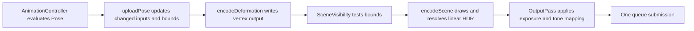

# Architecture and maintenance

The code separates asset preparation, CPU pose evaluation, GPU work, and browser controls. The renderer still follows the case study's central rule: prepare immutable state when loading, and reuse it when drawing.

## Module boundaries

| Directory        | Responsibility                                                                     | Dependencies                                           |
| ---------------- | ---------------------------------------------------------------------------------- | ------------------------------------------------------ |
| `src/gltf/`      | File decoding, validation, accessors, canonical geometry, selected-scene traversal | Web platform, gl-matrix; no renderer or viewer imports |
| `src/animation/` | Track preparation/interpolation and playback policy                                | glTF data and CPU scene poses                          |
| `src/scene/`     | Mutable node poses, revisions, shared deformation inputs, CPU deformation oracle   | glTF data and animation sampling; no GPU allocations   |
| `src/renderer/`  | Resource preparation, bindings, compute/render passes, lighting and presentation   | CPU modules and WebGPU; no viewer imports              |
| `src/app/`       | DOM controls, model/environment loading lock, status, demo and styles              | Public renderer API and loading helpers                |
| `src/main.ts`    | Start the viewer                                                                   | Application only                                       |

`gltf/scene.ts` traverses the selected asset scene for initial instances. `scene/pose.ts` evaluates the mutable runtime hierarchy. `renderer/scene/` builds GPU draw records and consumes pose revisions. These are deliberately separate responsibilities despite referring to the same glTF nodes.

`tests/architecture.test.ts` checks that CPU modules do not import the renderer/viewer, that renderer modules do not import the application, and that static module dependencies have no cycles. It reads raw source, so the checks do not require WebGPU globals.

## Public entry points

Embedding code can import from `src/index.ts`, which exports `Renderer`, settings/statistics types, `AnimationController`, asset types, and loading helpers. `src/renderer/index.ts` exports the rendering API alone. The existing `src/renderer/renderer.ts` entry and renderer methods remain available, including the animation forwarding aliases.

```ts
import { Renderer, loadUrl } from './src';

const renderer = await Renderer.create(canvas, showError);
await renderer.setAsset(await loadUrl(modelUrl));
renderer.animation.setPlaying(false);
renderer.setFrustumCulling(true);
```

Feature implementation paths moved during the refactor. Imports of internal files must use their new locations; application consumers should prefer the public entry points above. The code map in the README lists the new locations.

## Loading and ownership

`Renderer.setAsset()` creates candidate `Resources` and opens a GPU validation scope. `SceneBuilder.prepare()` constructs the candidate, including all pipelines and material bind groups. Only a successful candidate replaces the current scene and attaches its pose to the animation controller. Failure destroys candidate allocations and retains the displayed scene.

Preparation delegates vertex/index uploads to `GeometryUploader`. Its view and index caches live for one candidate scene. CPU `DeformationInputCache` and GPU `GpuDeformationInputCache` share immutable primitive inputs across nodes; each `GpuDeformation` retains separate output, palette and weights. The builder reuses one deformation pipeline across scene replacements. Material and scene pipeline caches remain scoped to a candidate scene.

| Owner                 | Owned state                                                                    | Released when                                                                |
| --------------------- | ------------------------------------------------------------------------------ | ---------------------------------------------------------------------------- |
| Scene `Resources`     | Geometry, instance transforms, material textures/uniforms, deformation buffers | Replacement, preparation failure, renderer disposal                          |
| `SceneBindings`       | Frame uniform buffer; explicit scene binding layouts                           | Renderer disposal                                                            |
| `Viewport`            | Matching depth attachment                                                      | Resize or renderer disposal                                                  |
| `OutputPass`          | HDR/MSAA attachments and presentation resources                                | Resize or renderer disposal                                                  |
| `EnvironmentLighting` | Environment maps and lighting parameters/LUT                                   | Environment replacement or renderer disposal, according to resource lifetime |
| `Renderer`            | Device/context, camera controls, RAF loop and subsystem coordination           | `destroy()`                                                                  |

Bind groups and pipelines do not have explicit destroy methods. Their references disappear with their owners. Layouts are fixed for the renderer lifetime; texture presence never changes the material interface.

## Frame phases



The frame loop in `Renderer` explicitly coordinates these phases:

1. Clear pending deformation records. Sample animation, then call `scene/pose-upload.ts` only if the pose changed or initial output needs preparation. Dirty transform records are coalesced only when adjacent.
2. Resize HDR/depth targets together through `Viewport`, and upload the camera through `SceneBindings`.
3. `deformation/pass.ts` encodes pending compute dispatches and ends the pass before vertex reads.
4. `SceneVisibility` creates contiguous visible instance runs using current bounds and the same view-projection matrix uploaded to the GPU. Visibility does not suppress changed pose uploads or compute work.
5. `render/pass.ts` submits opaque state groups and sorted visible transparent draws. It does not decode assets, upload poses, or dispatch deformation.
6. `OutputPass` presents the resolved linear HDR image. Submit the command buffer once.

Held or paused poses reuse output buffers. Conservative bounds update with the same pose dependencies as deformation. Skinned outputs are world-space; moving only the mesh node does not change their geometry. Culling preserves original transform indices through `firstInstance` rather than repacking instance buffers.

## Where to add features

| Change                               | Start here                                                        | Preserve                                                                              |
| ------------------------------------ | ----------------------------------------------------------------- | ------------------------------------------------------------------------------------- |
| Asset format or extension validation | `gltf/loader.ts`, `gltf/types.ts` and relevant decoder            | Useful failures before scene replacement                                              |
| Animation interpolation or playback  | `animation/tracks.ts`, `animation/controller.ts`, `scene/pose.ts` | Final-pose revision comparisons and CPU independence                                  |
| Deformation inputs or kernels        | CPU `scene/deformation*`, GPU `renderer/deformation/`             | Shared immutable inputs, node-owned outputs, phase separation and conservative bounds |
| Material textures or factors         | `renderer/materials/`, `renderer/render/shader.ts`                | Explicit layout, neutral defaults, sRGB color/linear data decoding                    |
| Visibility or draw batching          | `renderer/scene/`, `renderer/render/pass.ts`                      | Original instance addressing, winding and transparent ordering                        |
| Lighting or postprocessing           | `renderer/lighting/`, `renderer/presentation/`                    | Linear HDR through blending/MSAA resolve; encode sRGB once                            |
| Browser controls                     | `app/controls/`, `app/viewer.ts`                                  | One loading lock and renderer-independent core modules                                |

`core/bindings.ts` names frame/instance record sizes and creates the explicit layouts. Changing a record also requires updating its WGSL struct, upload offsets and binding validation. Keep pipeline keys limited to immutable state; material values and texture identities remain uniform/binding data.

## Verification

Run `npm test`, `npm run build`, and `npm run test:browser` after refactoring. Use `TEST_REMOTE_MODELS=1` for the public Khronos assets. Existing browser tests verify presented pixels, compute output against the CPU oracle, changed-pose upload ranges, immutable input sharing, replacement/disposal ownership, texture channels/transforms, HDR/MSAA, lighting, and visibility. They continue to inspect internal modules where necessary to prove GPU behavior; those imports are not public API contracts.

Use `npm run format:check` before finishing. The README documents supported features and limitations; this file documents ownership and extension points.
